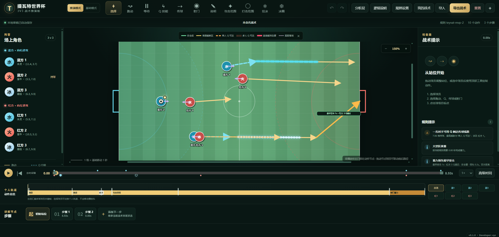
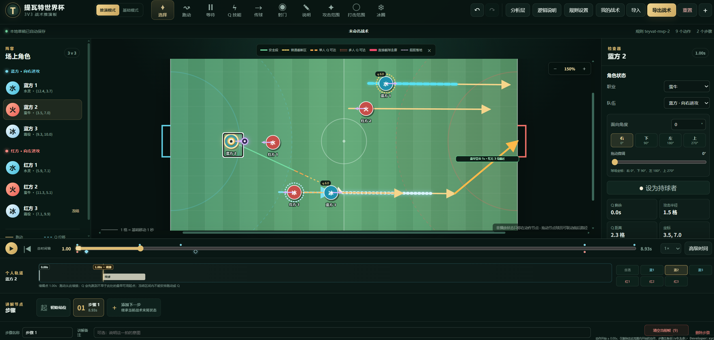
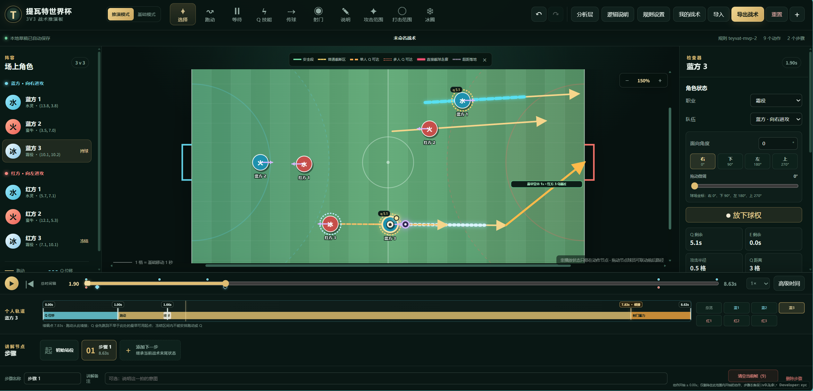

# 提瓦特世界杯战术板

一个面向现代桌面浏览器与手机横屏的 3v3 教练战术板。`v0.1.1` 支持静态站位布置、连续时间轴推演、个人球员轨道、空传与捡球、规则辅助、本地战术历史和 JSON 文件交换。

## 在线使用

- 在线战术板：[https://xyc2718.github.io/teyvat-tactics-board/](https://xyc2718.github.io/teyvat-tactics-board/)
- 源码仓库：[https://github.com/xyc2718/teyvat-tactics-board](https://github.com/xyc2718/teyvat-tactics-board)



*推演模式总览：在同一画面中完成站位、动作绘制、规则检查和时间轴复盘。*

## 主要功能

- **基础模式**：可为双方球员选择水、火、冰、雷、岩、风，调整初始站位并绘制静态移动箭头；水、火、冰、岩可查看攻击范围与“Q + 攻击”打击范围，不创建时间轴动作。
- **推演模式**：支持水、火、冰、岩四种职业，编排跑动、等待、Q 技能、传球、空传、射门、说明、挂冰和冰圈，并在统一时间轴上播放。
- **球员个人轨道**：点击球员即可切换其轨道；新建跑动、Q 或射门时会从该球员自己的最新关键帧继续，不受其他球员动作结束时间影响。
- **跑动编辑**：支持直线、可调曲线和贴身跟随；还可固定持续时间、跑到自身 Q 冷却结束，或对齐自己/其他球员的关键帧。结束时间固定，路线长度按实际加速、减速计算。
- **等待对齐**：等待可手动设置时长，也可持续到自己或其他球员的关键帧，例如加速结束。选择窗口同时显示球员姓名和职业。
- **技能与状态**：区分水、火、冰、岩的 Q 距离、持续时间、冷却和后续效果；支持冻结、挂冰减速、随霜役移动的冰圈，以及水 Q 和接球加速路径分段。
- **自动传接球**：用户设置出球时刻并选择队友，球在飞行中持续朝接球队员当前位置转向，因此移动接球时可能形成曲线。程序自动创建出球帧，接到球后创建接球帧；接球帧可直接秒传。
- **空传与捡球**：选择空传方向后，球减速飞行并在边界反弹；用跑动或 Q 点击足球可以创建捡球动作。程序自动解算接触时刻并生成捡球帧，Q 捡球后继续完成原位移。
- **射门分析**：射门自动指向对方球门，并结合禁区、蓄力时间、对手攻击范围、Q 冷却和冻结状态计算最早威胁；另行提示岩护罩的最早挡球时间，不改变原受击窗口颜色。
- **规则辅助**：分析层、逻辑说明和规则提示会展示传球截断风险、技能范围、身位变化与职业对位；规则参数和有方向的对位表均可调整。
- **本地战术库**：同一浏览器可新建、打开、复制和删除多份战术，每份战术自动保留最近 20 个去重历史版本，并支持整库备份与恢复。

## 快速使用

1. 在“初始站位”中使用“选择”工具拖动球员、足球或面向手柄；此时只调整静态开场状态。
2. 点击球员切换到其个人轨道，再选择“跑动”“等待”“Q 技能”或“射门”。如果还没有普通步骤，程序会自动创建“步骤 1”。
3. 创建跑动时点击空地设置终点，或点击另一名球员创建贴身跟随。选中跑动后，可在右侧切换直线/曲线并设置时间约束。
4. 传球会自动采用当前持球者；选择同队接球人后，程序自动解算传球路径、飞行时间和接球关键帧。也可以点击空地传向自由落点。
5. “挂冰”会打开球员时间轴窗口，只需选择目标球员和状态开始时刻；“冰圈”选择霜役后立即开启，无需再选落点。
6. 使用底部总时间轴播放或拖动战术；总时间轴下方显示当前球员的动作和关键帧。步骤用于划分与讲解战术阶段，不会复制动作。
7. 选中路线或动作可继续编辑；“高级时间”用于精确调整动作时序，“逻辑说明”用于查看按时间排序的规则解释。
8. “重置”需要两级确认，会把当前战术恢复到默认初始状态；“我的战术”中的旧历史版本不会因此被删除。

### 空传与捡球（v0.1.1）

1. 在希望出球的时刻选择“空传”，点击球场确定方向；空传不绑定任何队友，也不会追踪被点击的球员。
2. 球最多累计飞行 **6 格、3 秒**，速度线性减小。撞墙后反弹，剩余时间与路程不重置；进入球门开口则停止。
3. 选中捡球球员，再选择“跑动”或“Q 技能”，点击自由足球。跑动会追向飞行中的球，未能在飞行中追上时继续前往落点；只有明确创建的捡球动作才会获得球权。
4. Q 必须在规则允许的距离内、同一时刻穿过足球。接触后球跟随球员，Q 继续完成位移；冰 Q 仍可调整长短，但不能改成无法捡到球的路线，失败会弹窗并保留原动作。
5. “捡球”关键帧属于捡球球员，可在该时刻直接继续传球或空传。多个捡球动作以先接触者为准；同时接触会提示调整时序，不会随机判定球权。

只有**空传时已处于接球加速中的冰**，才会让空传球携带加速标记。同队球员捡起后重新开始一整段已配置的接球加速（默认 4.3 秒），不叠加强度；地面等待不消耗这一效果。未加速的冰空传不会附带加速，对手捡球也不获得加速，球本身不会因此飞得更快。

普通定向传球的新默认值是 **8 格、最长 2 秒**，接到球则提前结束。**已有战术、草稿、历史记录及导入文件保留原参数**，在旧战术中新增传球仍按其保存的参数计算；只有新建战术或主动恢复默认规则才使用新值。

### 基础模式职业选择

切换到“基础模式”，点击球员后，在球场外的职业选择栏选择水、火、冰、雷、岩或风。每名球员的基础职业独立保存，支持撤销、重做和存档；切回推演模式仍使用原来设置的水、火、冰或岩职业，不会改写已有动作。两种模式继续共用初始站位。

雷、风目前用于职业标识、站位和移动箭头，尚未配置攻击半径或 Q 距离，因此暂不显示攻击/打击范围圈，也不参与推演技能计算。岩在基础模式中也可显示攻击/打击范围。

### 万象（岩）职业与护罩分析

万象简称“岩”，默认攻击半径为 **1.5 格**，Q 为 **固定 2.4 格**的瞬时位移、冷却 **9 秒**；遇场地边界会截短。护罩按自身周围 **1 格**计算，仅作为风险分析，不需要添加开盾动作，也不会自动改写球权。

- **亮蓝色实线**：敌方岩在原地即可用护罩挡球。被冻结时仍可原地挡球。
- **蓝紫色虚线**：敌方岩可能在球到达之前，经跑动或 Q 抵达并挡球；计算会等待解冻和 Q 冷却，冷却期间允许先跑动。
- Q 挡球只检查**完整位移结束后的护罩范围**；途中穿过球路但落点过头不算。需要调整距离时，先计算跑到合法起跳位置所需的时间，再计算 Q；不以 Q 过头后折返代替落点判定。传球和射门使用同一规则。
- 两类标记覆盖普通传球和空传的实际路线（含反弹段），并保留原有普通截球颜色。**4 格内的普通截球安全距离不豁免岩护罩。**
- 除红蓄力射门外，若岩从射门开始算起能在 **严格小于 2 秒**内到达射门线，额外显示“岩最早挡球”提示。它与受击窗口独立，不改变原窗口的颜色。

上述抵达时间采用基础跑速近似，考虑 Q 固定长度、场地边界、冷却与冻结，不额外求解最优绕路或加减速路径。旧战术的已有参数和对位值会保留，仅为缺少的岩配置补入默认值；可在“规则设置”中查看四职业对位表。

### 传球与路径分析



*传球线会根据沿线风险分段显示；右侧检查器集中展示所选球员的职业、面向、球权、技能冷却和范围数据。*

### 个人轨道与关键帧



*总时间轴同步全部球员，个人轨道用于查看当前球员的动作与关键帧；下方步骤区负责划分讲解节点。*

### 关键时间逻辑

- “初始站位”是受保护的 `0s` 静止帧；在其中启用时序工具时，会自动进入后续普通步骤再写入动作。
- 同一球员的跑动、等待和 Q 默认首尾串联；不同球员使用各自的轨道，可以并行动作。
- 选中等待后点击“等待到关键帧”；选中普通跑动后勾选“固定跑动时间”，再点击“选择关键帧”。可切换六名球员的时间轴，当前球员标为“自己”；选择动作或状态节点后，结束时间会跟随该节点更新。
- 定时跑动保留实际速度变化，而不是把同一路线拉长播放时间。例如默认水 Q 加速完整覆盖的 4.3 秒跑动，在没有减速、冻结和边界阻挡时可走 5.1 格（基础 4.3 格 + 加速 0.8 格）。调整方向或曲线后，会按沿途效果重算可达位置。
- 来源失效时保留最后有效时长并改为手动时间；不能选择动作自身或互相依赖的结束节点。旧存档的定时跑动也采用上述距离计算，保存的规则参数和时间设置不变，但受加减速影响的箭头终点可能更新。
- 水、火与岩的 Q 在规则时间中是瞬时动作，同一时刻保留可区分的 Q 起点和 Q 终点；冰 Q 默认持续约 1 秒。
- 定向传球的接球时刻由程序解算，不要求预先落在任何已有关键帧上。
- 新战术的定向传球速度随时间线性减小，最多飞行 2 秒、累计 8 格（按曲线路径长度计算）；若仍未追到接球人，球会停在实际落点，不生成接球帧或接球加速。旧战术使用自身保存的参数。
- 冰角色连续接球会刷新加速时间，不叠加加速强度，也不会抹掉此前已经获得的加速位移。
- 传球与追击轨迹在战术编辑时计算并复用；播放和拖动时间轴不会重新求解整条传球路线。
- 暂停时会吸附到步骤、动作起止、接球、状态起止和技能就绪等关键节点；播放时才连续经过中间时间。

## 快捷键

| 按键 | 功能 | 按键 | 功能 |
| --- | --- | --- | --- |
| `V` | 选择 | `M` | 跑动/移动箭头 |
| `W` | 等待 | `Q` | Q 技能 |
| `P` | 传球 | `S` | 射门 |
| `L` | 空传 | | |
| `A` | 说明 | `K` | 攻击范围 |
| `R` | 打击范围 | `G` | 挂冰 |
| `E` | 冰圈 | `Space` | 播放/暂停 |
| `Ctrl+Z` | 撤销 | `Ctrl+Y` | 重做 |
| `Esc` | 取消当前操作 | `Delete` / `Backspace` | 删除所选动作或静态箭头 |

输入框获得焦点时，绘制工具快捷键不会触发。

## 手机横屏

- 粗指针小屏设备会自动进入手机布局，无需单独网址或安装应用。
- 竖屏时会显示旋转引导；浏览器无法自动锁定方向时，请关闭系统方向锁并手动旋转到横屏。
- 横屏以球场为主视图，阵容、检查器和完整时间轴通过覆盖面板打开；紧凑播放栏始终可用。
- 选择模式下，从球员、足球或控制点开始拖动会编辑对象；从球场空白处开始拖动会平移放大的球场。

## 本地存档与文件交换

- “我的战术”使用当前网站来源下的浏览器 IndexedDB。GitHub Pages 与本地开发地址属于不同来源，因此不会共享战术库。
- 每份战术自动保留最近 20 个内容不同的历史版本，可在“我的战术”中展开并恢复。
- 清除该网站的浏览器数据会删除战术库；建议定期使用“备份全部”下载整库备份。
- “导出战术”只导出当前战术；导入支持 `schemaVersion: 1` 的 JSON 文件，大小上限为 2 MB，并会校验结构、引用、球权与场地坐标。
- 当前版本没有账号、后端或云同步。跨浏览器、跨设备迁移请使用单份战术导出/导入或整库备份/恢复。

## 本地运行

需要 Node.js 20.19+ 和 pnpm。

```powershell
pnpm install
pnpm dev
```

浏览器打开终端显示的本地地址（通常为 `http://localhost:5173`）。

生产构建：

```powershell
pnpm build
pnpm preview
```

构建产物位于 `dist/`。本地构建使用相对资源路径，GitHub Actions 发布时自动使用仓库子路径。

## 当前范围

- 推演模式包含水灵、蛮牛、霜役和万象四个职业；基础模式额外支持雷、风的职业标识，不包含这两种职业的技能规则或范围参数。
- 规则数值是可校准的战术近似，不用于预测玩家反应、网络延迟或战术必然胜负。
- 暂不支持账号、云同步、实时多人协作、战术分享链接和手机竖屏完整编辑。

## 质量检查

```powershell
pnpm lint
pnpm typecheck
pnpm test
pnpm build
```

## 开源协议

本项目以 [GNU General Public License v3.0](./LICENSE) 发布，SPDX 标识为 `GPL-3.0-only`。

Copyright © 2026 xyc.
